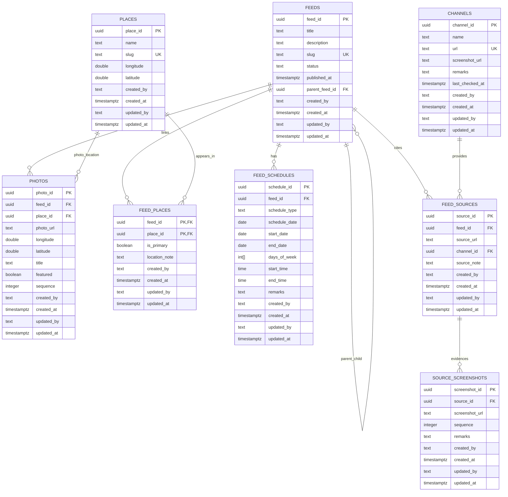

# AroundCities V2 Schema Review, ERD, and Migration Notes

Date: 2026-06-05

Reviewed inputs:

- `20260605_table_design_final.txt`
- `20260605_usecases_final.txt`

## Summary

The proposed model is close to the final use cases, but needs a few additions to support flexible feeds without forcing every feed into an event shape.

The main required changes are:

- Add `parent_feed_id` on `feeds` for major events, sub-events, updates, registration periods, and featured photos derived from another feed.
- Add source evidence tables separate from the existing manual admin source checklist.
- Replace single-date-only schedule storage with date-window capable schedule rows.
- Add richer feed-place relationship fields for primary place and location notes.
- Add audit columns to every product table as requested.
- Add photo ordering and optional photo coordinates.

## Use Case Coverage Review

| Use case | Supported by proposed schema? | Notes |
| --- | --- | --- |
| Single Day Event | Mostly | Needs source evidence and a schedule row. |
| Multi-Day Event | Partially | `feed_schedules.schedule_date` alone requires one row per day. Better to support start/end dates. |
| Major Event / Festival | Partially | Needs `feeds.parent_feed_id` for hierarchy and date range schedules. |
| Sub Event Within Larger Event | Mostly | Needs `parent_feed_id`; source/channel should remain optional. |
| Event Day | Mostly | Single schedule row works. |
| Registration Period | Partially | Needs schedule type or date-window semantics so registration windows are distinguishable from event dates. |
| Event Update / Announcement | Supported | Parent feed plus optional source; schedule can be null. |
| Food Discovery | Supported | Feed, photos, and place are enough. |
| Place Visit | Supported | Needs `feed_places` many-to-many relationship. |
| Event Experience | Supported | Parent feed and place are enough. |
| Business Discovery | Supported | Needs `feed_places.location_note`. |
| Seasonal Greeting | Supported | Feed can have no photos, place, source, or schedule. |
| Featured Photo | Supported after additions | Needs optional description and `parent_feed_id`; photo row holds the asset. |

## Tables / Fields That Cannot Support Use Cases

### `feed_schedules.schedule_date`

Problem:

- A single `schedule_date` does not naturally represent event ranges, registration windows, or recurring daily festival hours.

Recommended fix:

- Keep `schedule_date` for single-day convenience.
- Add `start_date`, `end_date`, `days_of_week`, and `schedule_type`.
- Use one row for a range such as `22 June - 20 August, daily 5 PM - 11 PM`.

### `feed_places` without metadata

Problem:

- Multiple places are supported, but the proposed basic join table does not identify the primary place or hold location notes like "Second Floor, Old Wing".

Recommended fix:

- Add `is_primary boolean`.
- Add `location_note text`.
- Add a partial unique index so only one primary place can exist per feed.

### `feeds` without `parent_feed_id`

Problem:

- Cannot model major event to sub-event, event to registration period, event update, event experience, or featured photo lineage.

Recommended fix:

- Add nullable self-reference `parent_feed_id`.

### Source evidence split

Problem:

- Existing `sources` is a manual curator checklist, not evidence tied to a feed.
- Use cases require feed-level source URL, source channel, and private screenshots.

Recommended fix:

- Add `channels`, `feed_sources`, and `source_screenshots`.
- Keep existing `sources` as the manual checklist unless the admin is refactored later.

### Audit fields

Problem:

- Current schema has timestamps but not `created_by` and `updated_by`.

Recommended fix:

- Add nullable text audit user fields for Phase 1 because Supabase Auth is not implemented yet.

## Missing Relationships

- `feeds.parent_feed_id -> feeds.feed_id`
- `feed_sources.feed_id -> feeds.feed_id`
- `feed_sources.channel_id -> channels.channel_id`
- `source_screenshots.source_id -> feed_sources.source_id`
- `feed_schedules.feed_id -> feeds.feed_id`
- `feed_places.feed_id -> feeds.feed_id` with `is_primary` and `location_note`
- `feed_places.place_id -> places.place_id`
- `photos.feed_id -> feeds.feed_id`
- Optional `photos.place_id -> places.place_id` should remain because individual photos can be more specific than the feed place.

## ERD

## Migration Scripts

The additive migration scripts are in:

- `supabase/migrations/20260605000000_v2_use_case_schema_extensions.sql`
- `supabase/migrations/20260605001000_enable_v2_rls_policies.sql`
- `supabase/migrations/20260605002000_add_remaining_audit_fields.sql`

They do not drop the current `feeds.content`, `feeds.source_url`, `feed_operating_hours`, or `sources` fields/tables because the current app uses them. They add the final-use-case schema around the existing implementation, backfill `feeds.description` from `feeds.content`, enable RLS for public published content, and add missing audit fields to older support tables.
